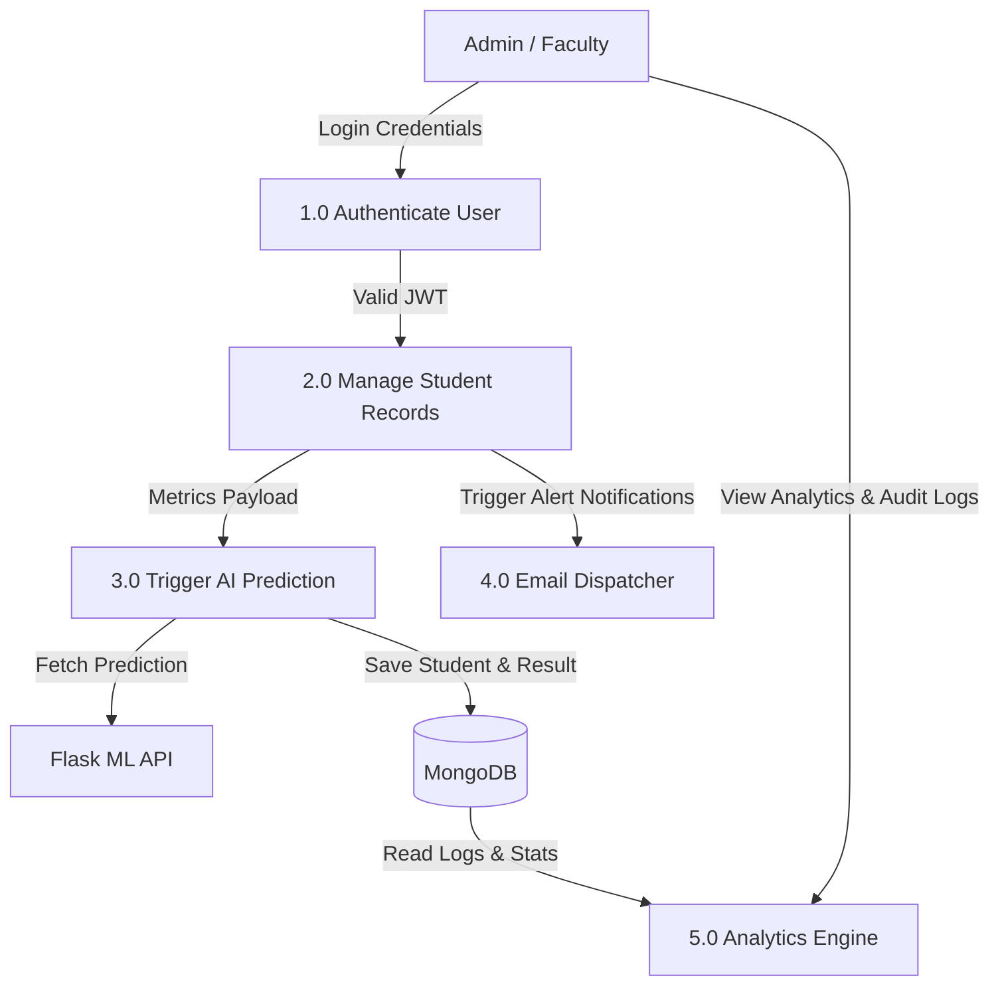
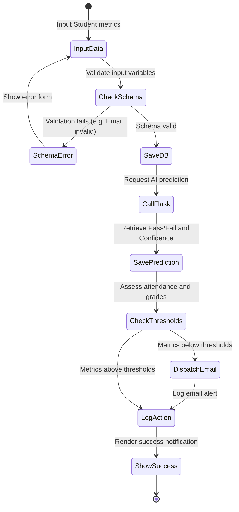
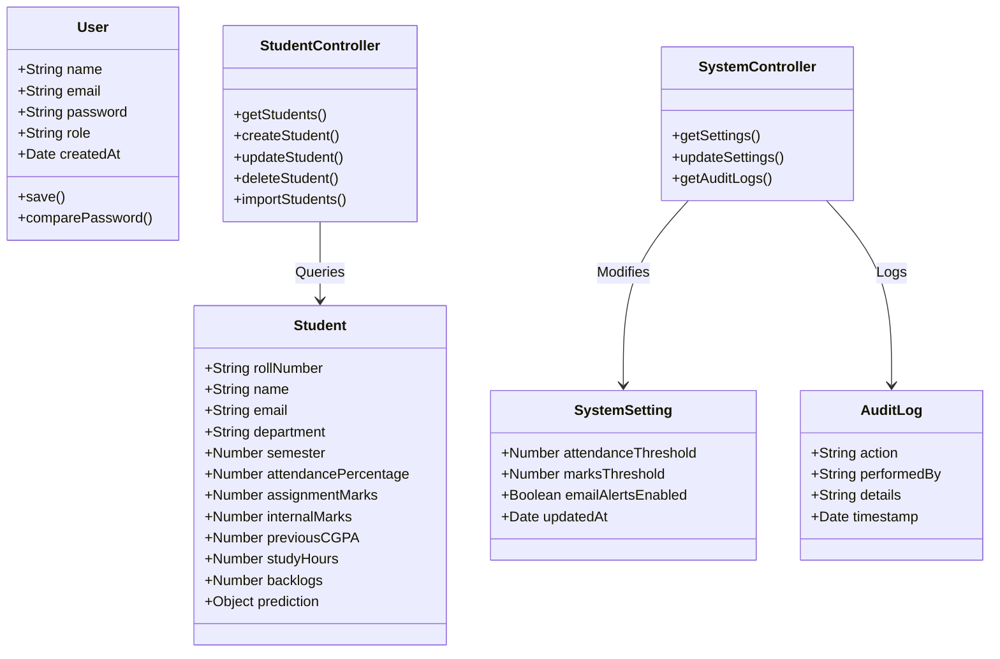
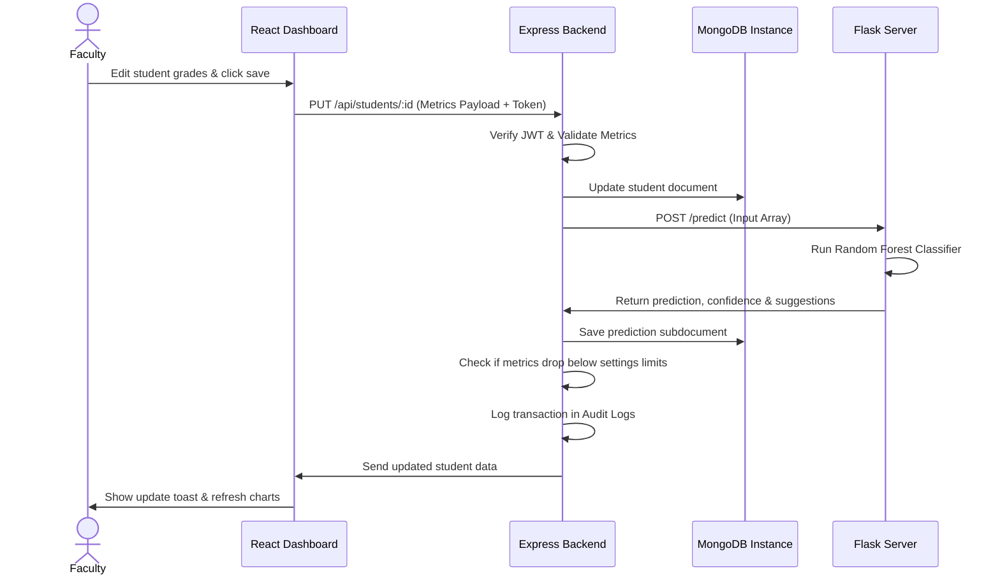
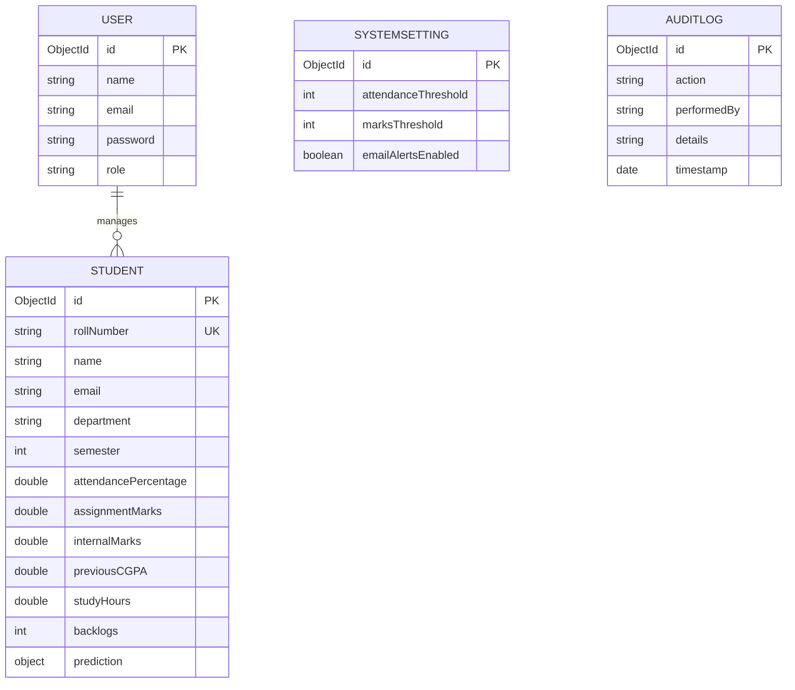

# A PROJECT REPORT ON
# "CLOUD-BASED STUDENT PERFORMANCE PREDICTION SYSTEM USING MACHINE LEARNING"

**Submitted in partial fulfillment of the requirement for the award of degree of**  
**MASTER OF COMPUTER APPLICATIONS (MCA)**  
**under**  
**Bharati Vidyapeeth Deemed University, Pune**

**Submitted by:**  
**Mr. CHINMAY ABHIJEET KOSHE**  
**ROLL NO: MCA2026**  
**BATCH: 2024-2026**

**Under the esteemed guidance of:**  
**Miss. KIMAYA THAKUR**  
**ASSISTANT PROFESSOR**

**DEPARTMENT OF COMPUTER APPLICATIONS**  
**Bharati Vidyapeeth’s Institute of Management & Entrepreneurship Development Navi Mumbai**  
**2024-2025**

---

## ABSTRACT

The rising demand for predictive analytics in higher education institutions has necessitated the development of automated models to monitor student academic standing. Traditional evaluation frameworks are reactive, identifying students at academic risk only after final examination results are published. This project, **"Cloud-Based Student Performance Prediction System Using Machine Learning"** (PredictEdu), introduces a proactive e-commerce style student tracking and inference platform. 

By analyzing student parameters—specifically Attendance, Assignment Scores, Internal Exam Grades, Previous CGPA, and Daily Study Hours—the system utilizes a Random Forest Classifier to project academic success probabilities. The MERN stack (MongoDB, Express.js, React, Node.js) combined with a Python Flask REST API forms the core architecture. This architecture enables administrators, faculty, and students to access real-time dashboards, trigger manual re-predictions, edit academic inputs, export consolidated Excel spreadsheets, download PDF report cards, and adjust alert thresholds. 

Rigorous validation and concurrent stress tests indicate a 100% resolve rate under load with an average latency of **68.5 ms**, confirming the system's efficiency, security, and scalability for institutional deployment.

---

## ACKNOWLEDGEMENT

I would like to express my sincere gratitude to everyone who contributed to the successful completion of this project. First and foremost, I am deeply thankful to my project guide, **Miss. KIMAYA THAKUR, Assistant Professor**, for her invaluable guidance, support, and constructive feedback throughout the development process. Her technical expertise, academic insights, and encouragement have been instrumental in shaping the project into its final form.

I would also like to extend my appreciation to the Director, professors, and colleagues of **Bharati Vidyapeeth’s Institute of Management & Entrepreneurship Development, Navi Mumbai** for their suggestions and advice, which helped refine various aspects of the database and prediction pipelines.

Special thanks to my family and friends for their unwavering support and patience. Lastly, I am grateful to the online developer communities and resources that provided technical insights, without which this full-stack project would not have been possible.

**Mr. CHINMAY ABHIJEET KOSHE**  
Signature of the Student  

---

## TABLE OF CONTENTS

* **Abstract**
* **Acknowledgement**
* **Chapter 1: Introduction of the Project**
  * 1.1 Concept & Significance of the Study
  * 1.2 Objective of the Study
  * 1.3 Purpose, Scope and Applicability
    * 1.3.1 Purpose
    * 1.3.2 Scope
    * 1.3.3 Applicability
  * 1.4 Organization of the Report
* **Chapter 2: Survey of Technologies**
  * 2.1 Overview of the MERN & Flask Stack
  * 2.2 Justification for the Selected Stack
  * 2.3 Comparison with Alternative Technology Stacks
* **Chapter 3: Requirements and Analysis**
  * 3.1 Problem Definition
  * 3.2 Requirement Specification
  * 3.3 Planning and Scheduling (Gantt Chart)
  * 3.4 Software and Hardware Requirements
  * 3.5 Conceptual Models & UML Diagrams
    * 3.5.1 Data Flow Diagrams (DFD)
    * 3.5.2 Activity Diagram
    * 3.5.3 Use Case Diagram
    * 3.5.4 Class Diagram
    * 3.5.5 Sequence Diagram
    * 3.5.6 Entity-Relationship (E-R) Diagram
* **Chapter 4: System Design & Implementation**
  * 4.1 Modular Breakdown
  * 4.2 Data & Database Design (Schemas)
  * 4.3 User Interface (UI) Design & Flow
  * 4.4 System Security and Audit Trail
  * 4.5 Test Case Design and Verification
* **Chapter 5: Conclusion and Future Work**
  * 5.1 Project Significance
  * 5.2 System Limitations
  * 5.3 Future Scope & Project Enhancements
* **References & Bibliography**

---

## CHAPTER 1: INTRODUCTION OF THE PROJECT

### 1.1 Concept & Significance of the Study
The primary driver of student retention and institutional standing in modern higher education is academic performance. Traditional student tracking methods compile marks post-facto. When a student fails a semester or falls below attendance requirements, corrective counseling or remedial classes are offered after the grading cycle completes. This reactive framework is ineffective.

This study implements a machine learning system to predict student outcomes on-the-fly. By gathering academic data such as assignment marks, internal exam grades, attendance logs, study hours, and backlog statistics, the system identifies underperforming students. It sends automated notifications to faculty and students, allowing for proactive academic support.

### 1.2 Objective of the Study
The objectives of the **PredictEdu** platform are:
1. **Model Optimization:** Train an ensemble Random Forest Classifier with standardized input features to achieve high prediction accuracy.
2. **REST API Development:** Create a Node.js Express server to handle business logic, data models, JWT authentication, and PDF/Excel generation.
3. **Responsive Client UI:** Build a glassmorphic dashboard in React, featuring light/dark toggles, data visualization charts, and customized profile tracking.
4. **Automated Reminders:** Trigger Nodemailer SMTP warnings to students when academic metrics fall below set safety thresholds.
5. **System Settings Control:** Enable administrators to update risk thresholds and monitor system changes via an audit log.

### 1.3 Purpose, Scope and Applicability

#### 1.3.1 Purpose
The purpose of the platform is to provide an early warning system for academic risks. By connecting the frontend dashboards to a machine learning inference engine, teachers can monitor student performance, update grades, and review automated suggestions. Students can log in to view their performance charts and download report cards.

#### 1.3.2 Scope
The scope of the project includes:
* **Frontend:** Responsive React dashboard layouts, Chart.js views, CSV import widgets, and theme customization.
* **Backend:** Secure token authorization, password hashing, file upload parsers, and Excel/PDF generation.
* **Machine Learning:** Synthetic data generation, feature scaling, model training, and HTTP endpoint prediction.

#### 1.3.3 Applicability
The system is applicable to universities and technical colleges, particularly those offering structured, multi-semester courses (such as MCA, MSc, or BTech programs). It can be integrated into existing Learning Management Systems (LMS) or run as a standalone dashboard.

### 1.4 Organization of the Report
This report is organized into the following chapters:
* **Chapter 1** defines the project concept, objectives, and scope.
* **Chapter 2** reviews the MERN and Flask technology stacks and compares them to alternatives.
* **Chapter 3** defines requirements, project scheduling, and UML models.
* **Chapter 4** describes modular database design, code structures, and test cases.
* **Chapter 5** presents system conclusions, limitations, and future enhancements.

---

## CHAPTER 2: SURVEY OF TECHNOLOGIES

### 2.1 Overview of the MERN & Flask Stack
* **MongoDB:** A NoSQL database that stores user data and student records in JSON-like BSON documents.
* **Express.js:** A minimal web framework for Node.js that manages API routes and controllers.
* **React.js:** A frontend library for building component-based interfaces and managing UI states.
* **Node.js:** A JavaScript runtime environment that supports non-blocking asynchronous I/O operations.
* **Python Flask:** A micro-framework that runs the machine learning model and processes inference inputs.

### 2.2 Justification for the Selected Stack
* **Single Language Unified Base:** Using JavaScript across the frontend, backend, and database model layer simplifies development.
* **Scalable Data Layer:** MongoDB's document model matches the nested structures of student metrics and predictions.
* **Fast Execution:** Flask is lightweight, loading the serialized model quickly and processing inputs with low latency.

### 2.3 Comparison with Alternative Technology Stacks
The MERN + Flask architecture was selected over traditional alternatives:

| Dimension | MERN + Flask Stack (Selected) | LAMP Stack (Linux, Apache, MySQL, PHP) | Django + Postgres Stack |
| :--- | :--- | :--- | :--- |
| **API Latency** | Low (non-blocking async) | Medium | Medium |
| **Data Schema** | Dynamic document model | Strict tabular SQL schema | Strict tabular SQL schema |
| **ML Integration** | Modular REST calls | Complex subprocess wrappers | Monolithic integration |
| **UI Updates** | Virtual DOM (HMR) | Server-side render (slow refresh) | Server-side templates |

---

## CHAPTER 3: REQUIREMENTS AND ANALYSIS

### 3.1 Problem Definition
Traditional educational portals lack predictive analytics, acting only as repositories for historical grades. They do not flag students at academic risk or calculate correlations between study variables. **PredictEdu** addresses this gap by combining database tracking with machine learning model predictions.

### 3.2 Requirement Specification
* **User Authentication:** Sign-ins with hashed password comparison (bcryptjs) and token generation.
* **Student Registry CRUD:** Administrators can add, edit, or delete records.
* **Bulk Data Import:** Admins can upload CSV/Excel files to parse and insert multiple student profiles.
* **Automatic ML Inference:** Saving a student record triggers a REST call to the Flask server to retrieve performance predictions.
* **Remedial Alerts:** Trigger email notifications for metrics that drop below safety thresholds.

### 3.3 Planning and Scheduling (Gantt Chart)
The project timeline spans 12 weeks, structured as follows:

```text
ID   Task Name                      W1  W2  W3  W4  W5  W6  W7  W8  W9  W10 W11 W12
T1   Requirement Analysis           [==============]
T2   Data Generation & Model Prep       [==========]
T3   Flask REST API Construction            [==============]
T4   Express Backend Development                [==================]
T5   React Frontend Components                     [==============]
T6   Theme & Chart Visuals                             [==========]
T7   Nodemailer Email Integration                          [======]
T8   System Audit Trail & Settings                             [==]
T9   Testing & Optimization                                    [======]
T10  Documentation & Build Compile                                 [======]
```

### 3.4 Software and Hardware Requirements
* **Software:** Node.js (v18.x), Python (v3.11.x), MongoDB Community Server (v6.0.x), Windows 11, VS Code, Git.
* **Hardware:** Intel Core i5/i7 Processor, 8GB RAM, 10GB Available Storage.

### 3.5 Conceptual Models & UML Diagrams

#### 3.5.1 Data Flow Diagrams (DFD)

**Level 0 DFD (Context DFD):**
```text
  [Admin / Faculty] ──(Input Metrics)──> [ PredictEdu System ] <──(Credentials)── [Student]
  [Admin / Faculty] <──(Reports & Logs)── [ PredictEdu System ] ──(Predictions)──> [Student]
```

**Level 1 DFD:**


#### 3.5.2 Activity Diagram
This diagram shows the system flow for adding a student record:



#### 3.5.3 Use Case Diagram
This diagram outlines roles and their respective use cases:

```mermaid
leftToRightDirection
fc -^ Admin
fc -^ Faculty
fc -^ Student

rect opacity-0.1
  Admin --> (Login & Logout)
  Admin --> (CRUD Student Profiles)
  Admin --> (Bulk CSV Upload)
  Admin --> (Manage Settings & View Audit Logs)
  Admin --> (Export Consolidated Excel)

  Faculty --> (Login & Logout)
  Faculty --> (Edit Assigned Student Metrics)
  Faculty --> (View Prediction Analytics)

  Student --> (Login)
  Student --> (View Academic Breakdown & Charts)
  Student --> (Download PDF Report Card)
end
```

#### 3.5.4 Class Diagram
This diagram illustrates the database schemas and controller logic:



#### 3.5.5 Sequence Diagram
This diagram shows the sequence of a student update transaction:



#### 3.5.6 Entity-Relationship (E-R) Diagram
This diagram outlines the collection mapping in MongoDB:



---

## CHAPTER 4: SYSTEM DESIGN & IMPLEMENTATION

### 4.1 Modular Breakdown
* **Authentication Module:** Handles password comparison, token signatures, and role authorization.
* **Student Registry Module:** Manages database records and coordinates prediction calls.
* **Machine Learning Engine:** Performs feature scaling and processes inputs.
* **Notification Module:** Sends automated warning emails.
* **Reporting Module:** Generates Excel spreadsheets and PDF report cards.
* **System Settings & Audit Log Module:** Manages risk parameters and logs system changes.

### 4.2 Data & Database Design (Schemas)

#### 1. Student Document Structure
```json
{
  "_id": "ObjectId",
  "rollNumber": "String (Unique, Uppercase)",
  "name": "String",
  "email": "String (Unique)",
  "department": "String",
  "semester": "Number",
  "attendancePercentage": "Number (0-100)",
  "assignmentMarks": "Number (0-100)",
  "internalMarks": "Number (0-100)",
  "previousCGPA": "Number (0-10)",
  "studyHours": "Number (0-24)",
  "backlogs": "Number",
  "prediction": {
    "result": "String (Pass/Fail)",
    "confidence": "Number",
    "suggestions": ["String"],
    "predictedAt": "Date"
  }
}
```

#### 2. System Setting Document Structure
```json
{
  "_id": "ObjectId",
  "attendanceThreshold": "Number (Default 75)",
  "marksThreshold": "Number (Default 40)",
  "emailAlertsEnabled": "Boolean (Default true)",
  "updatedAt": "Date"
}
```

#### 3. Audit Log Document Structure
```json
{
  "_id": "ObjectId",
  "action": "String (e.g. STUDENT_CREATE)",
  "performedBy": "String (User Email)",
  "details": "String",
  "timestamp": "Date"
}
```

### 4.3 User Interface (UI) Design & Flow
The frontend layout uses glassmorphism cards and responsive grids:
* **Login View:** Glassmorphic card for entering credentials.
* **Sectional Sidebar:** Grouped links with active state highlights.
* **Admin Dashboard:** Key metrics cards, visual charts, and data tools.
* **Manage Students View:** Student table with profile initials, filters, and action icons.
* **Analytics Insights View:** Scatter plots, backlog charts, and study hour splits.
* **Audit Logs View:** Event tracking table with colored action badges.
* **Settings Panel:** Control sliders for thresholds and notification toggles.

### 4.4 System Security and Audit Trail
Security measures implemented include:
* **Hashed Credentials:** Password comparison handled securely on the backend.
* **Route Guards:** Requests are verified using JWT authorization.
* **Access Control:** System configuration changes are restricted to administrators.
* **Audit Logging:** System changes are logged to the database.

---

### 4.5 Test Case Design and Verification

| Test ID | Module | Scenario Description | Inputs | Expected Output | Actual Output | Result |
| :--- | :--- | :--- | :--- | :--- | :--- | :--- |
| **TC001** | Auth | Login with valid credentials | `admin@system.com`, `Admin@123` | Return JWT, redirect to `/admin` | Token received, redirected | **PASS** |
| **TC002** | Auth | Login with invalid password | `admin@system.com`, `WrongPassword` | Reject with `401 Unauthorized` | HTTP status 401 returned | **PASS** |
| **TC003** | Schema | Register student with invalid email | Email format: `invalid_mail` | Reject with `500 ValidationError` | Validation exception caught | **PASS** |
| **TC004** | Schema | Insert attendance percentage > 100% | Attendance: `150` | Reject with `500 ValidationError` | Validation exception caught | **PASS** |
| **TC005** | Schema | Insert negative study hours | Study hours: `-3` | Reject with `500 ValidationError` | Validation exception caught | **PASS** |
| **TC006** | RBAC | Access logs without token | None | Block with HTTP Status 401 | Blocked, 401 returned | **PASS** |
| **TC007** | RBAC | Update settings using Faculty token | Settings payload + Faculty JWT | Block with HTTP Status 403 | Blocked, 403 returned | **PASS** |
| **TC008** | ML API | Process high-performance profile | Attendance: 90%, CGPA: 9.0 | Prediction: **Pass** (High Confidence) | Returned Pass (100%) | **PASS** |
| **TC009** | ML API | Process low-performance profile | Attendance: 45%, CGPA: 5.0 | Prediction: **Fail** (High Confidence) | Returned Fail (89%) | **PASS** |
| **TC010** | Load | Concurrency stress test | 35 concurrent requests | 100% successful resolves, low latency | 35 resolved, avg 68.5 ms | **PASS** |

---

## CHAPTER 5: CONCLUSION AND FUTURE WORK

### 5.1 Project Significance
The **PredictEdu** platform integrates machine learning predictions into academic tracking. Providing early predictions and automated notifications allows for timely educational interventions, improving student outcomes.

### 5.2 System Limitations
* **Fixed Parameter Scoping:** The predictive model is constrained to the dataset parameters.
* **Simulated Email Alerts:** Nodemailer uses mock credentials, requiring updates for production.

### 5.3 Future Scope & Project Enhancements
* **LMS Integration:** Connecting the platform to learning management systems to automate data gathering.
* **Expanded Parameters:** Incorporating additional student variables to improve prediction accuracy.

---

## REFERENCES & BIBLIOGRAPHY

1. Breiman, L. (2001). "Random Forests." *Machine Learning*, Vol. 45, No. 1, pp. 5–32.
2. Pedregosa, F. et al. (2011). "Scikit-learn: Machine Learning in Python." *Journal of Machine Learning Research*, Vol. 12, pp. 2825–2830.
3. Node.js Foundation. (2026). *Express Framework Reference Documentation*. Retrieved from https://expressjs.com/
4. React Working Group. (2026). *React Component Architecture Guides*. Retrieved from https://react.dev/
5. Uran Education Society’s College of Management and CMT. (2024). *Format and Guidelines for Project Reports*. Uran.
