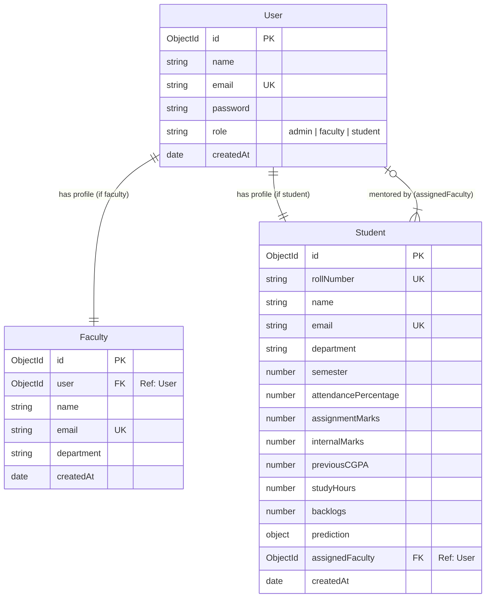
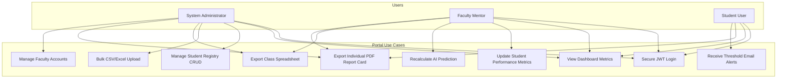
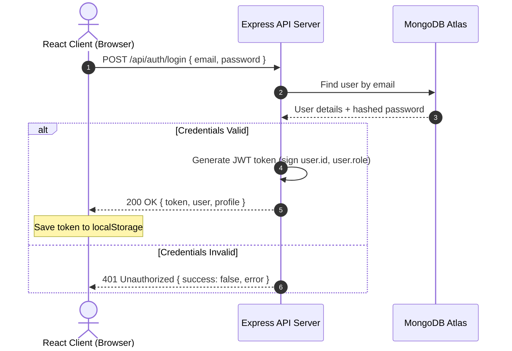
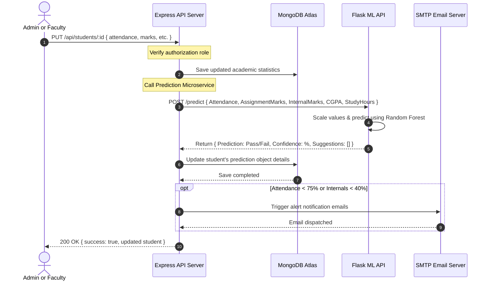
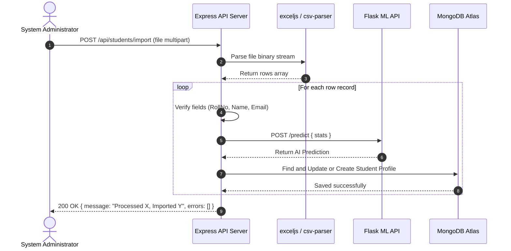

# System Architecture Diagrams

This document contains visual workflow representations of the system designed using **Mermaid.js**.

---

## 1. Entity-Relationship Diagram (ERD)

Shows database collections, schemas, and fields.

---

## 2. Use Case Diagram

Visualizes the core user interactions per roles.

---

## 3. Sequence Diagrams

### Use Case A: Authentication Flow

### Use Case B: Performance Modification & Predictive Inference Flow

This diagram demonstrates how changing a student's grades automatically updates their AI prediction.

### Use Case C: CSV / Excel Spreadsheet Import Flow

